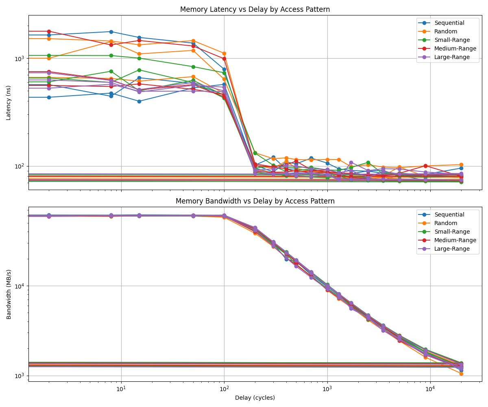
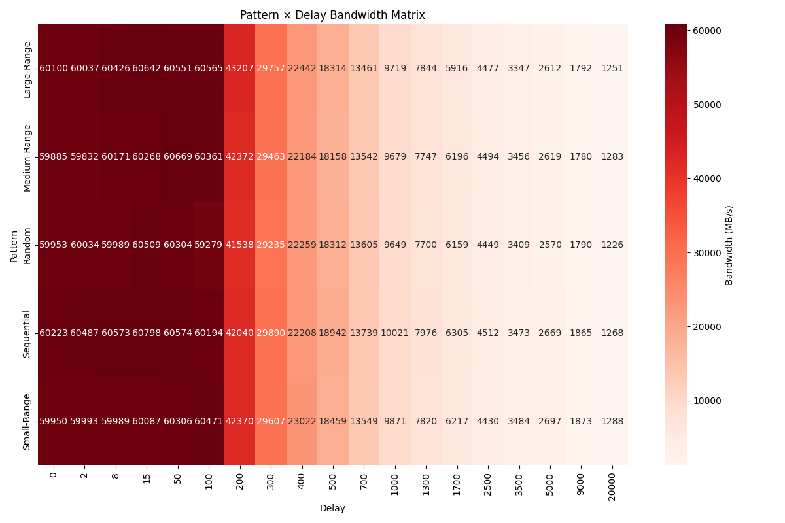
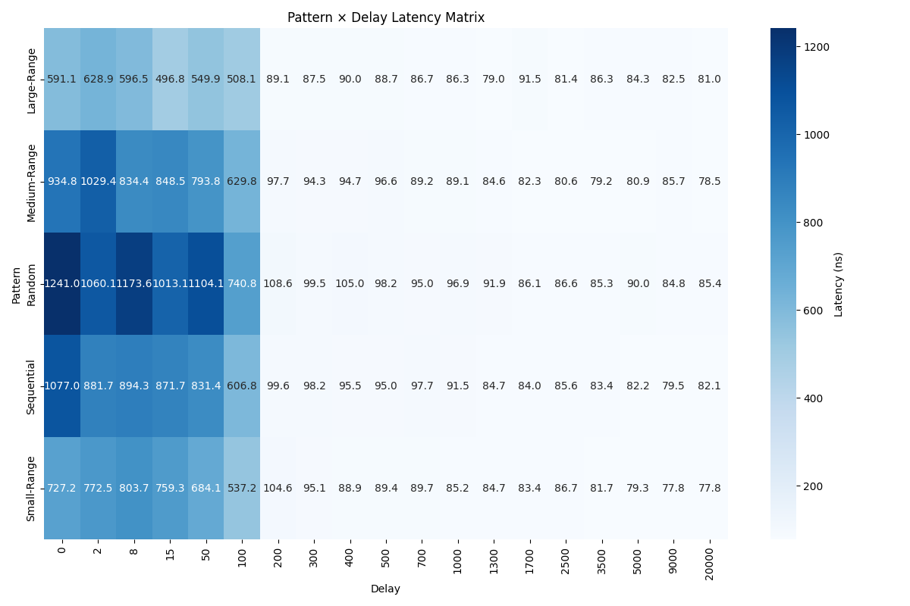
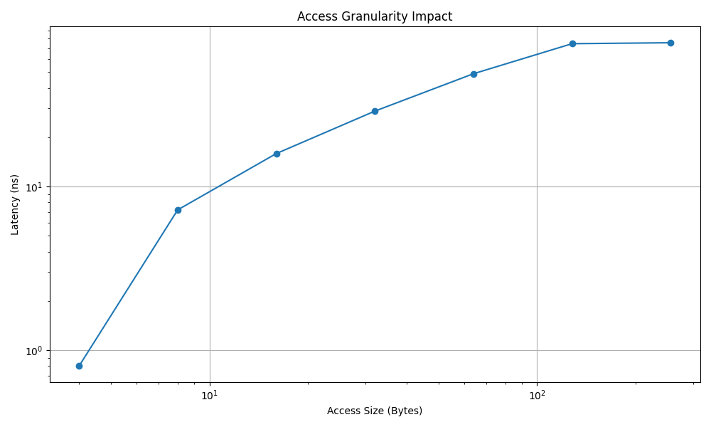

# Part2 - Cache Hierarchy and Memory Access Pattern Analysis

## Overview
This section contains comprehensive analysis of cache hierarchy behavior and memory access patterns using various benchmarking tools and methodologies.

## Contents

### Scripts
- `plot_results.py` - Python script for generating performance visualization plots
- `ZeroQue.ps1` - PowerShell script that started as the zeroqueu but expanded to the rest. 

### Results Data
The `results/` directory contains CSV files with benchmark data from multiple test runs:
- **Cache Hierarchy Performance/Zero Queue** 
- **Pattern Sweep**: Different memory access pattern evaluations
- **Granularity Sweep**: Testing different memory access granularities
- **Intensity Sweep**: Varying computational intensity measurements
- **Read/Write Mix**: Non functioning
- **TLB Miss Analysis**: Non functioning
- **Cache Miss Analysis**: Non Functioning

### Cache Hierarchy Performance/Zero queue
- L1 cache: 32 KiB per core, 8-way associative
- L2 cache: 1 MiB per core, 8-way associative  
- L3 cache: 32 MiB shared, 16-way associative
- RAM: 32GB DDR5 6000Mt/s CL32

| Level | Size | Avg Latency (ns) | Std Dev (ns) | Min (ns) | Max (ns) | Avg Cycles | Std Dev Cycles |
|-------|------|------------------|--------------|----------|----------|------------|----------------|
| L1 | 32k | 0.80 | 0.00 | 0.80 | 0.80 | 4.40 | 0.00 |
| L2 | 512k | 2.67 | 0.06 | 2.60 | 2.70 | 14.67 | 0.32 |
| L3 | 8m | 11.20 | 0.46 | 10.70 | 11.60 | 61.60 | 2.52 |
| DRAM | 200m | 71.67 | 0.21 | 71.50 | 71.90 | 394.17 | 1.14 |

### Memory Access Patterns
Analysis covers various patterns including:
- Sequential access patterns
- Random access patterns
- Strided access patterns

MLC desables prefetch. With low delay/high memory acess, Strides, especially large strides seem to have had a minimizing effect on latency, I would imagine this is due to having the ability to talk to multiple banks at once.

As the requested data gets larger, latency increased 

### R/W Sweep

[text](<results/rw_mix_3/raw_rw_100% Read.txt>)

| Ratio | Bandwidth MB/s |
|-------|------|
| 100% Read | 61338.7
| 3:1 R:W | 65829.7
| 2:1 R:W  | 66948.1
| 1:1 R:W | 62144.6
| Stream-triad like | 67887.6

There does not seem to be any meaningfull difference in bandwidth with different Read-Write ratios. ALl results are between 61-67 GB/s.

The Benchmark with targeted W/R sweeps did not work right and so I was unable to make a plot as the data is all N/A

### Intensity Sweeps
My Pattern X Delay did the intensity sweeps

Knee Location: 200 cycle delay

Bandwidth at Knee: 43.7 GB/s

**Peak Bandwidth Achieved**: 61.4 GB/s (64% of theoretical peak)
**Theoretical Maximum**: 96 GB/s (DDR5-6000 Duel Channel)

**Diminishing Returns Analysis**:
Maximum Intensity: 60.6 GB/s (63.1%)
Medium Intensity: 29.3 GB/s (30.5%)
Low Intensity: 9.7 GB/s (10%)

As the CPU asks for less Data, the bandwidth goes down. 
I do wonder what is preventing me from getting that last 30% of bandwidth. 

**Little's Law**: Throughput = Concurrency / Latency
**Rearranged**: Throughput × Latency = Concurrency (constant for given system)

**Analysis Results**:
- High Intensity Region: 31.3 GB⋅μs/s average
- Low Intensity Region: 0.4 GB⋅μs/s average
- Ratio: 0.0x

### Working-Set size sweep

Not done at all

### Cache-miss impact

My bench broke on this test and only gives me N/A, There is no data to analyze

### TLB-miss impact

My bench broke on this test and only gives me N/A, There is no data to analyze

## Usage
1. Run ZeroQue.ps1 benchmark script to collect performance data make sure its pointed to MLC
2. Use `plot_results.py` to generate visualizations
3. Analyze results in the `plots/` directory

## System Configuration
- **CPU**: Ryzen 7 7700X (up to 5.5GHz)
- **RAM**: DDR5 6000Mt/s CL32 Duel Channel Single Rank

---
[← Back to Main README](../README.md)