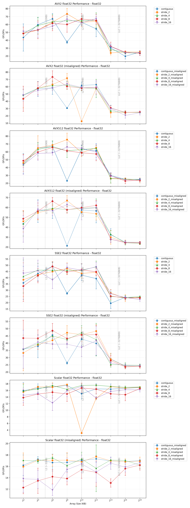
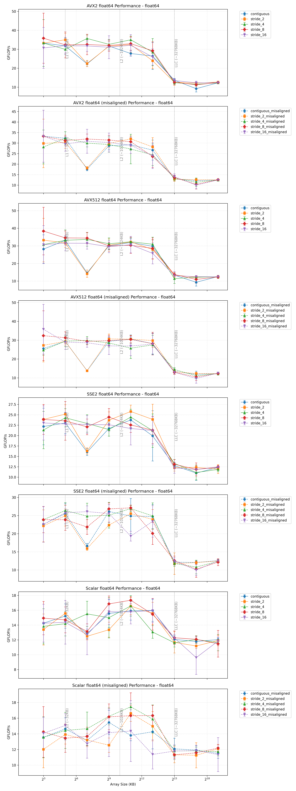
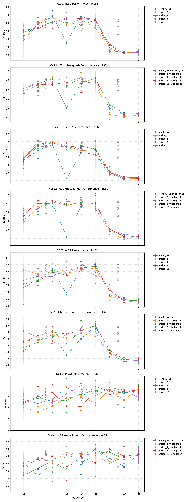
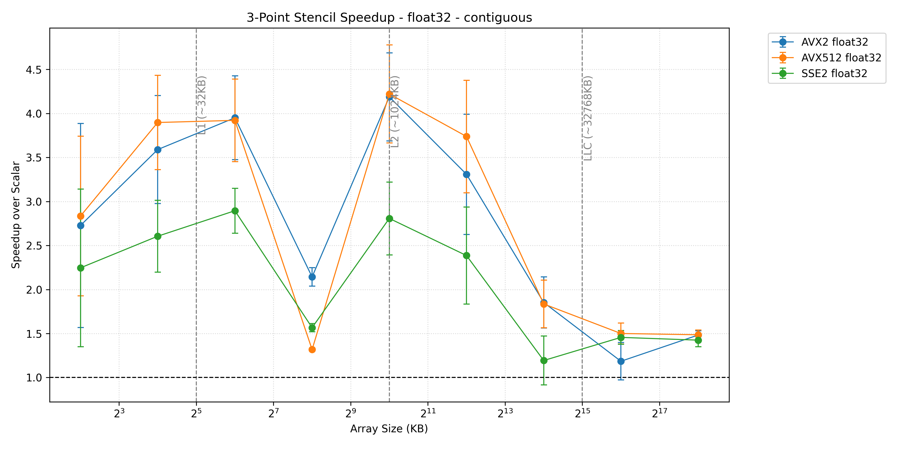
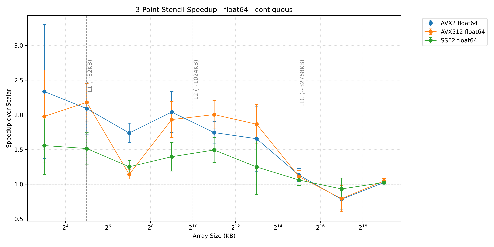
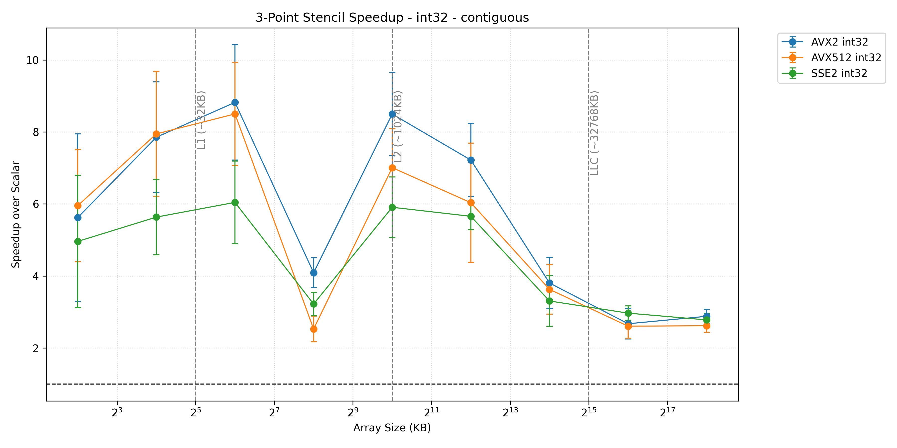

# Project13dpointstencil - 3D Point Stencil SIMD Operations

## Overview

3dpoint stencil was interesting as because the opperations did 5 ops per memory access request I was able to get higher GFLOPS showing that SAXPY And Dot Product are memory bound even at the L2 level. I am also showing that weird behavior that I had in SAXPY of the performance tanking when the data nearly filling l2 and crossing into l3

## Related Projects
- [Dot Product](../Project1DotProduct/README.md) - Fundamental SIMD operations
- [SAXPY](../Project1Saxpy/README.md) - Linear algebra SIMD implementations

---
[← Back to Main README](../README.md)