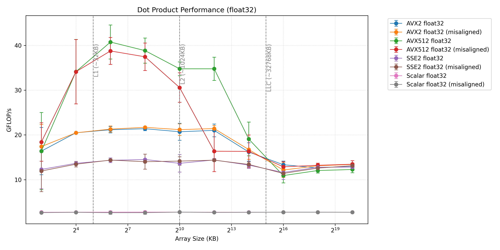
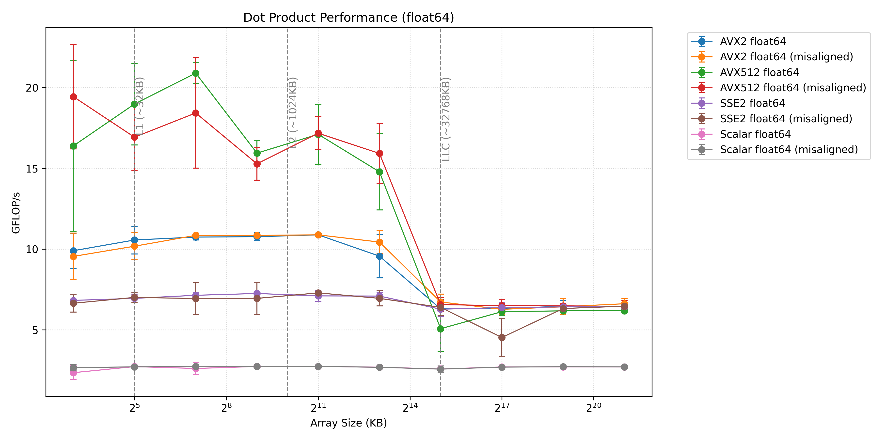
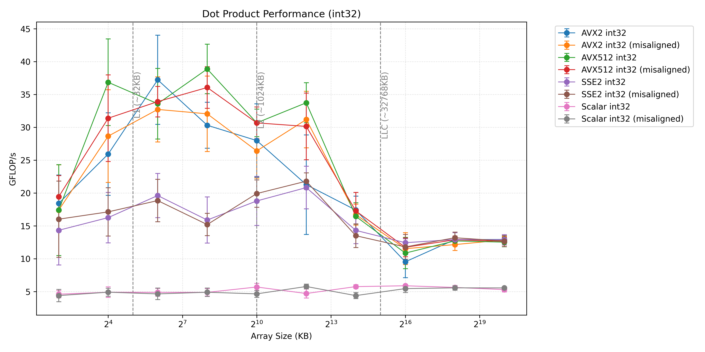
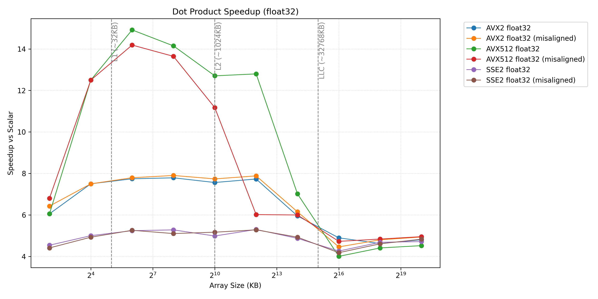
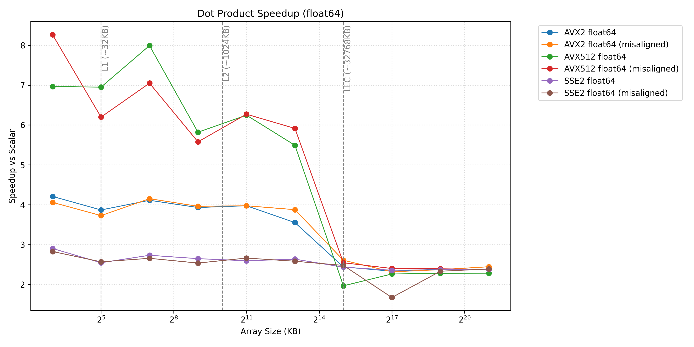
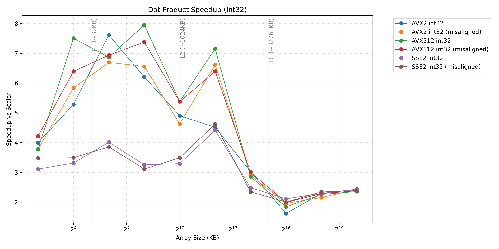

# Project1DotProduct - SIMD Dot Product Optimization

Adding charts for Dot Product 

Same problems as with SAXPY, Chrono to granular for L1 cache and gives unreliable data
It is interesting to see the compute to bandwidth bound change from saxpy 
Scaler and SSE2 are always compute bound. 
AVX becomes bandwidth bound at DRAM and AVX bexomes bandwidth bound in L3. 
## Related Projects
- [SAXPY Implementation](../Project1Saxpy/README.md) - Related SIMD optimization project
- [3D Point Stencil](../Project13dpointstencil/README.md) - Advanced SIMD applications

---
[← Back to Main README](../README.md)