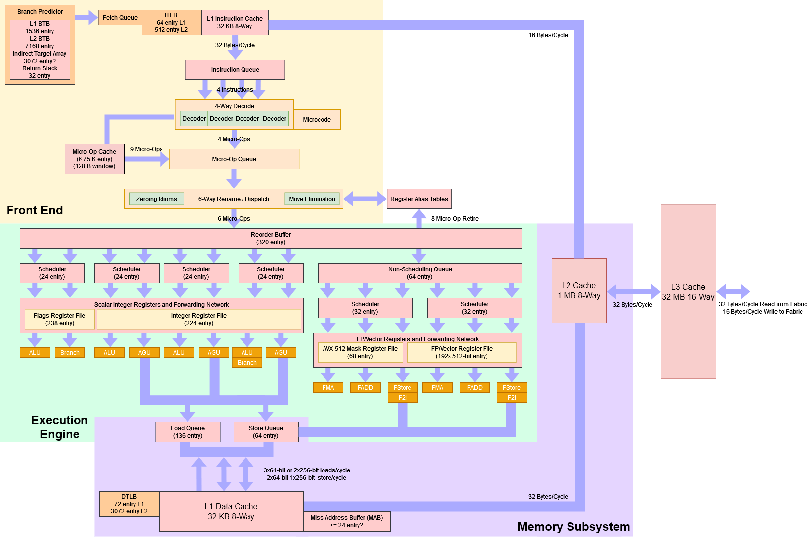
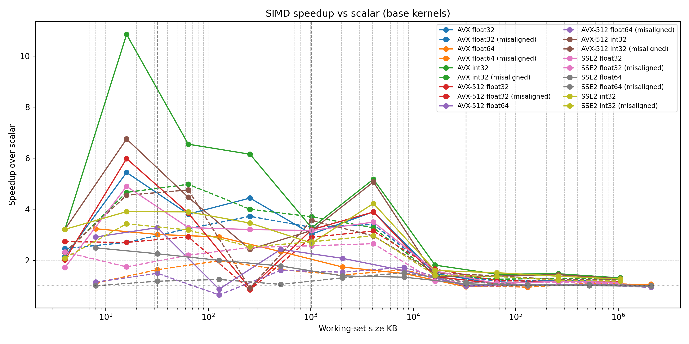

# Project1Saxpy - SIMD SAXPY Implementation

## Overview
This project implements the SAXPY operation (Single-precision A*X Plus Y) using SIMD vectorization techniques. SAXPY is a fundamental linear algebra operation that computes `Y = a*X + Y` where `a` is a scalar, and `X` and `Y` are vectors.

## Contents

## Compilation Requirements
- **Compiler**: GCC 14.2.0 with SIMD support
- **Flags**: `-O3 -mavx2 -mfma -mavx512f -fno-tree-vectorize`
- **Architecture**: x86-64 with AVX2/AVX-512 support

## System Configuration
- **CPU**: Ryzen 7 7700X (up to 5.5GHz)
- **Memory**: DDR5 6000Mt/s CL32 for optimal bandwidth
- **Cache**: 32KB L1d, 1MB L2, 32MB L3 per specifications
- **SMT State**: On

### Source Code
- `SaxpyMain.cpp` - Main SAXPY implementation with SIMD optimizations

### Benchmark Data
- `saxpy_benchmark.csv` - Comprehensive performance results

### Analysis Scripts
- `plot_saxpy.py` - Main plotting script for SAXPY performance analysis

### Results
The `plots_output/` directory contains extensive performance visualizations:

### Performance Analysis

#### Baseline vs Vectorized and Locality Sweep
Tests where ran 10 times and median result is what is graphed with error bars. 

When working sets are in L1 cache with the 4K entry working set (16KB)
AVX512 Managed to achive 45GFLOPS (too fast for chrono to measure)
AVX managed to get 41GFLOPS 
SSE2  managed to do 22GLOPS 
Scaler managed to achive Sub 10GFLOP

For Double precision the 4K entry working set (32KB)
AVX512 managed 16-20GFLOPS
AVX managed 16-20GFLOPS 
SSE2 managed 12GFLOPS
Scaler managed 5.8GFlops

This data set is problematic. 

Chrono made the 4k set data very course and not accurate or preceiss hence the large error bars. the 1K set data had a lot of infinit GFLOPs that got culled. I need a counter to measure these that the OS does not provide. So the farthest left data point is mostly trash data. 

Int32 workloads are incoreclty labled as GFLOPS through my entire report rather then GFOPS. . 

I have a reaccuring oddity half way into the L2 data set where performance falls off in an unexpected way. I really want to dig into why as performance rebounds at the L2-L3 Barrier. I suspect there is a lot of hard faults due to some kind of threading or idata being held there that the CPU chooses to not try the tread when the data size fills L2? But I really have no actual clue

For AVX and AVX512 I become noticiably bandwidth bound by the time im in L3, and when I hit DRAM SSE2 and Scaler workloads become bandwidth bound. 

The gains For all vecorization for all workloads collapsed from a 2-6x speed up when in the cache down to 1 - 1.5x speed up when in DRAM. 

#### Verified Vecotirzation
Zen4 AVX512 support isnt "real" it doublepumps avx512 vectors. I would like to try to run this code on a Zen 5 chip to see if when inside its 48KB L1 cache if that would run in the 70-80GFLOP range. 

One thing I found odd was all vectorized ASM functions used the VPADD/VPMULL instrtuctions which came from the AVX 512, but the ASM states when SSE compiled it still came from the SSE library. I suspect that based off of the block diagram and performance, that this is correct behavior, I was just surprised by it. Wikichip (https://en.wikichip.org/wiki/x86/avx-512) describes it as correct behavior from my reading as well

"If the destination is a vector register and the vector size is less than 512 bits AVX and AVX-512 instructions zero the unused higher bits to avoid a dependency on earlier instructions writing those bits. If the destination is a mask register unused higher mask bits due to the vector and element size are cleared."

So because I am using the correct vector registers for each instruction, it just zeros it out the upper bits and they all use the same instructions. 

Scaler
 # C:\Users\MattsDesktop\ECSE6320P1SIMD\SimdMain.cpp:42:         y[i] = a * x[i] + y[i];
	.loc 1 42 18 is_stmt 0 view .LVU7
	movl	(%rdx,%rax,4), %r10d	 # MEM[(const int32_t *)x_12(D) + i_19 * 4], _4
	imull	%ecx, %r10d	 # a, _4
 # C:\Users\MattsDesktop\ECSE6320P1SIMD\SimdMain.cpp:42:         y[i] = a * x[i] + y[i];
	.loc 1 42 25 view .LVU8
	addl	%r10d, (%r8,%rax,4)	 # _4, MEM[(int32_t *)y_14(D) + i_19 * 4]
	.loc 1 41 5 is_stmt 1 discriminator 3 view .LVU9
	addq	$1, %rax	 #, i

SSE2
 # C:/msys64/ucrt64/lib/gcc/x86_64-w64-mingw32/14.2.0/include/smmintrin.h:328:   return (__m128i) ((__v4su)__X * (__v4su)__Y);
	.loc 6 328 33 is_stmt 0 view .LVU226
	vpmulld	(%rdx,%rax,4), %xmm1, %xmm0	 # MEM[(const __m128i * {ref-all})x_20(D) + i_39 * 4], tmp141, _30
.LBE2630:
.LBE2637:
.LBB2638:
.LBB2633:
 # C:/msys64/ucrt64/lib/gcc/x86_64-w64-mingw32/14.2.0/include/emmintrin.h:1072:   return (__m128i) ((__v4su)__A + (__v4su)__B);
	.loc 5 1072 33 view .LVU227
	vpaddd	(%r8,%rax,4), %xmm0, %xmm0	 # MEM[(const __m128i * {ref-all})y_21(D) + i_39 * 4], _30, _18
.LBE2633:
.LBE2638:
.LBB2639:
.LBB2636:
 # C:/msys64/ucrt64/lib/gcc/x86_64-w64-mingw32/14.2.0/include/emmintrin.h:742:   *__P = __B;
	.loc 5 742 8 view .LVU228
	vmovdqu	%xmm0, (%r8,%rax,4)	 # _18, MEM[(__m128i_u * {ref-all})y_21(D) + i_39 * 4]
.LVL55:

AVX2
 # C:/msys64/ucrt64/lib/gcc/x86_64-w64-mingw32/14.2.0/include/avx2intrin.h:562:   return (__m256i) ((__v8su)__A * (__v8su)__B);
	.loc 3 562 33 is_stmt 0 view .LVU44
	vpmulld	(%rdx,%rax,4), %ymm1, %ymm0	 # MEM[(const __m256i * {ref-all})x_20(D) + i_39 * 4], tmp173, _30
.LBE2582:
.LBE2589:
.LBB2590:
.LBB2585:
 # C:/msys64/ucrt64/lib/gcc/x86_64-w64-mingw32/14.2.0/include/avx2intrin.h:121:   return (__m256i) ((__v8su)__A + (__v8su)__B);
	.loc 3 121 33 view .LVU45
	vpaddd	(%r8,%rax,4), %ymm0, %ymm0	 # MEM[(const __m256i * {ref-all})y_21(D) + i_39 * 4], _30, _18
.LBE2585:
.LBE2590:
.LBB2591:
.LBB2588:
 # C:/msys64/ucrt64/lib/gcc/x86_64-w64-mingw32/14.2.0/include/avxintrin.h:935:   *__P = __A;
	.loc 2 935 8 view .LVU46
	vmovdqu	%ymm0, (%r8,%rax,4)	 # _18, MEM[(__m256i_u * {ref-all})y_21(D) + i_39 * 4]
.LVL11:
	.loc 2 935 8 view .LVU47
.LBE2588:

AVX12
 # C:/msys64/ucrt64/lib/gcc/x86_64-w64-mingw32/14.2.0/include/avx512fintrin.h:4382:   return (__m512i) ((__v16su) __A * (__v16su) __B);
	.loc 8 4382 35 is_stmt 0 view .LVU621
	vpmulld	%zmm2, %zmm1, %zmm1	 # tmp146, _23, _37
.LVL165:
	.loc 8 4382 35 view .LVU622
.LBE2748:
.LBE2755:
.LBB2756:
.LBB2751:
 # C:/msys64/ucrt64/lib/gcc/x86_64-w64-mingw32/14.2.0/include/avx512fintrin.h:4671:   return (__m512i) ((__v16su) __A + (__v16su) __B);
	.loc 8 4671 35 view .LVU623
	vpaddd	%zmm0, %zmm1, %zmm1	 # tmp150, _37, _34
.LBE2751:
.LBE2756:
.LBB2757:
.LBB2754:
 # C:/msys64/ucrt64/lib/gcc/x86_64-w64-mingw32/14.2.0/include/avx512fintrin.h:9505:   __builtin_ia32_storedqusi512_mask ((int *) __P, (__v16si) __A,
	.loc 8 9505 37 view .LVU624
	vmovdqu32	%zmm1, (%r8){%k1}	 # _34,* _12, mask_20
.LVL166:
.L95:

#### Baseline vs Vectorized

## Related Projects
- [Dot Product Implementation](../Project1DotProduct/README.md) - Complementary SIMD project
- [3D Point Stencil](../Project13dpointstencil/README.md) - Advanced SIMD applications

---
[← Back to Main README](../README.md)