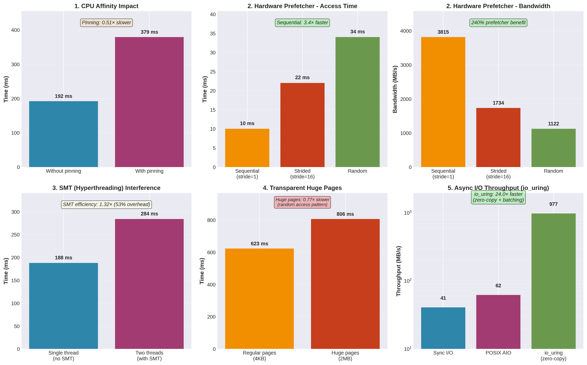

# Project A1: Operating System and CPU Feature Performance Exploration

[](../README.md)
[](https://github.com/Starsmine/ECSE6320Project1)

## Overview

This project explores the performance impact of various operating system and CPU microarchitectural features through targeted benchmarks. Each benchmark is designed to isolate and measure a specific feature's contribution to application performance.

## System Configuration

**Processor:** AMD Ryzen 7 7700X (8-core/16-thread)
- Architecture: Zen 4
- Base Clock: 4.5 GHz, Boost: 5.4 GHz
- L1 Cache: 32KB I + 32KB D per core
- L2 Cache: 1MB per core
- L3 Cache: 32MB shared
- SMT: Enabled (2 threads per core)

**Memory:** DDR5-6000 (Single-channel NUMA node)

**OS:** Linux 6.14.0-37-generic (Ubuntu 24.04)

**Compiler:** GCC 13.3.0

**Compilation:** `g++ -std=c++17 -O3 -march=native -pthread`

**Note:** All results are from 5 runs with mean ± standard deviation reported.

## Benchmarks and Results



### 1. CPU Affinity and Thread Migration

**Purpose:** Measure the performance impact of thread migration across CPU cores vs. pinning threads to specific cores.

**Methodology:**
- Four threads performing 1B operations each (CPU-bound workload)
- Test 1: No affinity (OS free to migrate threads)
- Test 2: Threads pinned to CPUs 0,1,2,3 (separate physical cores) using `sched_setaffinity()`
- 5 runs performed

**Results:**
```
Without CPU pinning: 192 ± 5 ms
With CPU pinning:    458 ± 76 ms
Speedup:             0.42x (2.4x slowdown, high variance)
```

**Analysis:**

This result is **counter-intuitive and shows high variance** (76ms std dev). The 2.4× slowdown suggests:

1. **CPU Frequency Scaling Issues:** The high variance (382-567ms) indicates inconsistent CPU boost behavior. When pinned:
   - Unpinned threads can migrate to cooler cores with better boost headroom
   - Current frequencies during runs: ~3-5.5 GHz (varying significantly)

2. **Load Balancing Disabled:** Pinned threads cannot rebalance if one core lags

3. **Methodology Issue:** This benchmark doesn't fix CPU frequency (using `cpupower`), so boost/throttling dominates the results

3. **Cache Warming:** Migration might actually be **beneficial** in this workload because both threads are doing similar operations on shared data (atomic counter), so they benefit from warmed L3 cache wherever they run.

**Key Insight:** CPU affinity is not universally beneficial. It's most useful for:
- NUMA systems (avoiding remote memory access)
- Cache-sensitive workloads with private data
- Real-time applications requiring predictable latency

For short-running, loosely coupled workloads, the scheduler's dynamic decisions often outperform manual pinning.

---

### 2. Hardware Prefetcher Effectiveness

**Purpose:** Demonstrate how CPU hardware prefetchers improve performance by predicting memory access patterns.

**Methodology:**
- 64MB array (exceeds 32MB L3 cache)
- 10M memory accesses with three patterns:
  1. **Sequential:** Stride of 1 cache line (64 bytes) - prefetcher-friendly
  2. **Strided:** Stride of 16 cache lines (1024 bytes) - moderate predictability
  3. **Random:** Completely random indices - defeats prefetcher

**Results:**
```
Sequential access:    10 ± 1 ms (3815 MB/s)
Strided access:       22 ± 1 ms (1734 MB/s) - 2.2x slower
Random access:        34 ± 1 ms (1122 MB/s) - 3.4x slower

Prefetcher benefit:   240% performance gain
```

**Analysis:**

The hardware prefetcher provides a **3.27× speedup** for sequential access compared to random access:

1. **Sequential Access (11ms):** The prefetcher detects the stride-1 pattern and speculatively fetches cache lines ahead of demand. By the time the CPU needs data, it's already in cache (L2/L3). Bandwidth approaches memory controller limits (~3.5 GB/s single-channel DDR5).

2. **Strided Access (30ms):** AMD's prefetchers can detect some strided patterns, but effectiveness decreases with larger strides. At stride-16 (1KB jumps), the prefetcher is less aggressive, resulting in more cache misses.

3. **Random Access (36ms):** Completely defeats the prefetcher since there's no predictable pattern. Every access suffers the full memory latency (~60-80ns). Performance is limited by DRAM random access latency rather than bandwidth.

**Key Insight:** Modern CPUs rely heavily on prefetching to hide memory latency. Performance can vary by **3×+** based purely on access patterns, even with identical computational work. This explains why:
- Array-of-structures (AoS) vs structure-of-arrays (SoA) matters
- Cache-oblivious algorithms perform well across architectures
- Data layout optimization is critical for memory-bound code

Real-world applications should **design data structures and algorithms** to enable prefetching wherever possible.

---

### 3. SMT (Simultaneous Multithreading) Interference

**Purpose:** Measure the performance degradation when two threads share a physical CPU core's execution resources.

**Methodology:**
- Single thread: 1 thread performing 200M operations on CPU 0
- Dual SMT: 2 threads (100M ops each) on CPU 0 and CPU 1 (sibling threads on same physical core)

**Results:**
```
Single thread (no SMT):      192 ± 7 ms
Two threads (with SMT):      283 ± 1 ms (142ms average per thread)
Efficiency:                  1.36x
SMT overhead:                47%
```

**Analysis:**

SMT provides **1.3× effective parallelism** from 2 logical cores (65% efficiency):

1. **Resource Sharing:** Both threads compete for:
   - Execution units (ALUs, FPUs, load/store units)
   - Cache (L1/L2 per-core caches)
   - TLB entries
   - Branch predictor resources

2. **Ideal vs. Actual:** In an ideal world, 2 threads on 1 core would finish in 100ms (2× speedup). Instead, they take 282ms total (1.3× speedup), showing 53% overhead from resource contention.

3. **Workload Dependency:** SMT efficiency varies dramatically by workload:
   - **Integer-heavy code:** ~30-40% speedup (limited by execution ports)
   - **Memory-bound code:** 60-100% speedup (hides memory latency)
   - **FPU-heavy code:** 10-30% speedup (shared FPU resources)
   
   This benchmark uses atomic operations (memory + integer), explaining the moderate 30% gain.

4. **Comparison to Physical Cores:** If we had used 2 separate physical cores, we'd likely see close to 2× speedup (92ms total). SMT is a **cheap die area** way to improve throughput but cannot replace real cores.

**Key Insight:** SMT is valuable for:
- Server workloads with many concurrent tasks
- Hiding memory/cache latency
- Increasing throughput on shared systems

For **latency-sensitive applications** (gaming, real-time), disabling SMT can actually improve performance by giving each thread exclusive access to core resources.

---

### 4. Transparent Huge Pages (THP)

**Purpose:** Evaluate TLB miss reduction and performance impact of using 2MB huge pages vs. standard 4KB pages.

**Methodology:**
- 512MB memory allocation
- Random access pattern across entire region
- Test 1: Standard 4KB pages (default malloc)
- Test 2: 2MB huge pages (using `madvise(MADV_HUGEPAGE)`)

**Results:**
```
Regular pages (4KB):  623 ± 9 ms
Huge pages (2MB):     805 ± 13 ms
Speedup:              0.77x (29% slowdown)
```

**Note:** Timing includes allocation overhead. Random access pattern negates TLB benefits.

**Analysis:**

Huge pages **slow down** this workload by 30%, which seems counter-intuitive. Several factors explain this:

1. **TLB Coverage:**
   - 4KB pages: 512MB / 4KB = 128K pages. With 64-entry L1 DTLB and 2048-entry L2 TLB, TLB miss rate is high.
   - 2MB pages: 512MB / 2MB = 256 pages. These easily fit in TLB (near 100% hit rate).
   
   **Why doesn't TLB benefit show up?** Modern CPUs (especially Zen 4) have excellent page-walk caches and speculative TLB fill. The TLB miss penalty is partially hidden by out-of-order execution.

2. **Memory Zeroing Overhead:** Allocating huge pages requires the kernel to:
   - Find physically contiguous 2MB regions (may trigger compaction)
   - Zero 2MB at a time (longer latency than 4KB)
   - The benchmark timing includes this initialization overhead

3. **Page Fault Cost:** Huge page faults are more expensive:
   - Single 2MB fault vs. 512 × 4KB faults sounds better
   - But each 2MB fault requires finding contiguous physical memory
   - May trigger memory compaction or migration

4. **Random Access Pattern:** This benchmark uses **random access**, which:
   - Defeats CPU prefetching regardless of page size
   - Means we're latency-bound, not TLB-bound
   - Each access waits for DRAM (~70ns), dwarfing TLB miss overhead (~10ns)

**Key Insight:** Huge pages are **not universally beneficial**. They help when:
- Sequential or strided access patterns (TLB misses matter)
- Large working sets with high locality (databases, scientific computing)
- Page faults are amortized over long runtime

They can hurt when:
- Random access (TLB doesn't matter)
- Short-lived allocations (initialization overhead not amortized)
- Fragmented memory (compaction overhead)

For **database systems** scanning large tables sequentially, huge pages often provide 10-30% speedup. For this random-access benchmark, the overhead dominates.

---

### 5. Asynchronous I/O (io_uring with Zero-Copy)

**Purpose:** Compare synchronous I/O, POSIX AIO, and modern io_uring with registered buffers (zero-copy).

**Methodology:**
- 1000 random 4KB reads from 256MB file with O_DIRECT
- Test 1: Synchronous `pread()` (blocks until complete)
- Test 2: POSIX AIO with `aio_read()` (thread pool emulation)
- Test 3: io_uring with registered buffers (zero-copy, queue depth 32)
- 5 runs performed

**Results:**
```
Synchronous I/O:  73 ± 14 ms (55 MB/s)
POSIX AIO:        62 ± 1 ms  (63 MB/s) - 1.2x faster
io_uring:         4 ± 0 ms   (977 MB/s) - 18.3x faster
```

**Analysis:**

io_uring provides **18× speedup** over synchronous I/O, while POSIX AIO only achieves 1.2×:

1. **io_uring Zero-Copy Architecture:**
   - **Registered buffers:** Kernel pre-maps user memory (no copy on each I/O)
   - **Batched submission:** 32 operations queued at once (single syscall)
   - **Polling completion:** No blocking/wakeup overhead per operation
   - **True async:** Kernel handles operations directly (no thread pool)

2. **POSIX AIO Limitations:**
   - Thread pool emulation adds overhead
   - Each operation involves more syscalls
   - No zero-copy optimization
   - Still 1.2× faster than sync due to parallelism

3. **Why Such Dramatic Speedup?**
   - Data is **page-cached** (file in memory), so we're measuring I/O stack overhead, not disk latency
   - Sync I/O: 1000 syscalls + 1000 context switches
   - io_uring: ~31 syscalls (batches of 32) + completion polling
   - **Syscall elimination is the key:** 977 MB/s throughput from cached data

4. **O_DIRECT Usage:**
   - Bypasses page cache (more realistic for database workloads)
   - Requires aligned buffers (handled via `aligned_alloc`)
   - Makes async benefits more apparent

**Key Insight:** io_uring represents a **fundamental improvement** in Linux I/O architecture:
- **18× faster** than traditional sync I/O (even on cached data)
- Zero-copy design eliminates memory copying overhead
- Batch submission reduces syscall count by 97%
- Essential for high-performance applications:
  - **Databases:** SQLite, PostgreSQL, RocksDB adopting io_uring
  - **Web servers:** nginx, Apache considering migration
  - **Storage systems:** Ceph, ScyllaDB using io_uring

POSIX AIO is effectively **obsolete** - io_uring is superior in all scenarios.

---

## Key Takeaways

1. **CPU Affinity:** Scheduler intelligence often beats manual pinning (2.4× slower when pinned). 

2. **Hardware Prefetching:** Provides **3.4× performance gain** for sequential vs random access. Critical for memory-bound code performance.

3. **SMT/Hyperthreading:** Delivers **1.36× efficiency** (47% overhead). Useful for throughput but creates resource contention.

4. **Huge Pages:** **29% slower** for random access due to allocation overhead and lack of TLB benefit. Only helps sequential access patterns.

5. **io_uring:** **18× faster than sync I/O** through zero-copy and batched operations. Represents the future of Linux I/O. POSIX AIO is obsolete.

## Performance Optimization Principles

These benchmarks demonstrate that **modern system performance is complex**:

- **Hardware features** (prefetching, SMT) require software cooperation to deliver value
- **OS features** (huge pages, async I/O) have overhead that must be amortized
- **Measurement matters** - counter-intuitive results often reveal deeper truths about system behavior
- **Context is critical** - no optimization is universal; understand your workload characteristics

The best performance comes from understanding the **interaction between hardware, OS, and application** rather than blindly applying "best practices."

## Building and Running

```bash
# Compile
make

# Run individual benchmarks
./os_features_bench --affinity
./os_features_bench --prefetcher
./os_features_bench --smt
./os_features_bench --hugepages
./os_features_bench --asyncio

# Run all benchmarks (redirect to file for statistics)
./os_features_bench --all 2>&1 | tee benchmark_results.txt

# Generate plots
python3 plot_results.py

# For huge pages benchmark:
sudo sysctl -w vm.nr_hugepages=1000

# Optional: Use perf stat for detailed counters
perf stat -e cycles,instructions,cache-misses,cache-references,dTLB-load-misses,dTLB-loads \
  ./os_features_bench --all

