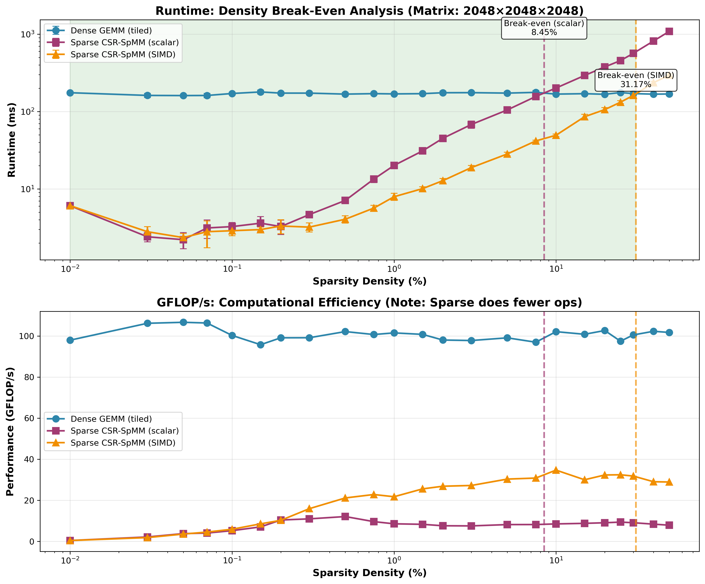
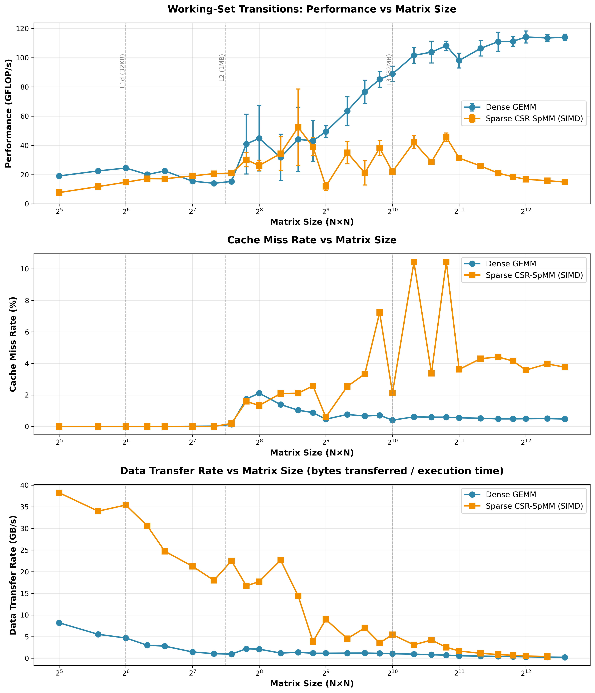
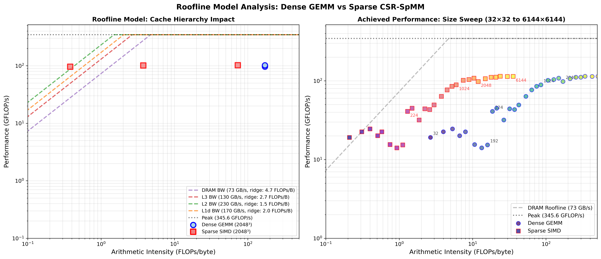

# ProjectA2 - Dense vs Sparse Matrix Multiplication

[](../README.md)
[](https://github.com/Starsmine/ECSE6320Project1)

## Overview
This project implements and benchmarks **dense matrix multiplication (GEMM)** using tiled/blocked algorithms versus **sparse matrix multiplication (CSR-SpMM)** with both scalar and SIMD optimizations. The goal is to analyze the performance trade-offs between dense and sparse algorithms as a function of matrix density, working set size, thread scaling, and arithmetic intensity.

## Project Requirements
1. **Correctness & Baselines**: Validate implementations against OpenBLAS reference
2. **SIMD & Threading Speedup**: Measure performance scaling across thread counts
3. **Density Break-even Point**: Find where sparse becomes faster than dense
4. **Working-Set Transitions**: Identify cache hierarchy boundaries (L1d → L2 → L3 → DRAM)
5. **Roofline Interpretation**: Analyze arithmetic intensity and memory/compute boundedness

## Compilation Requirements
- **Compiler**: GCC with SIMD and OpenMP support
- **Flags**: `-O3 -march=native -fopenmp`
- **Libraries**: OpenBLAS for validation (CBLAS interface)
- **Architecture**: x86-64 with AVX/AVX-512 support

## System Configuration
- **CPU**: AMD Ryzen 7 7700X (Zen 4)
  - 8 cores + SMT (16 threads)
  - Base: 4.5 GHz, Boost: 5.4 GHz
  - **AVX-512**: Double-pumped (2 cycles per 512-bit op)
  - **Peak FLOPS**: 345.6 GFLOP/s (8 cores × 8 FLOPs/cycle × 5.4 GHz)
- **Memory**: DDR5-6000
- **Cache Hierarchy**:
  - L1d: 32 KB per core (170 GB/s per core)
  - L2: 1 MB per core (230 GB/s aggregate)
  - L3: 32 MB shared (130 GB/s)
  - DRAM: 73 GB/s (measured)
- **Bandwidth Source**: [Chips and Cheese - Zen 4 Memory Subsystem Analysis](https://chipsandcheese.com/p/amds-zen-4-part-2-memory-subsystem-and-conclusion)

## Project Structure

### Source Code
- `main.cpp` - Matrix multiplication implementations:
  - Dense GEMM with cache-blocking/tiling
  - Sparse CSR-SpMM (scalar and SIMD variants)
  - Correctness validation against OpenBLAS
  - Performance counters (perf_event API)
- `Makefile` - Build system with OpenBLAS linking

### Benchmark Orchestration
- `run_benchmarks.py` - Automated benchmark sweeps:
  - Density sweep (0.0% to 50%)
  - Size sweep (32×32 to 6144×6144, 28 data points)
  - Thread scaling (1, 2, 4, 8, 16 threads)
  - Structure variations (square, tall, fat matrices)
- `benchmark_config.txt` - Configuration parameters

### Analysis Scripts
- `analyze_results.py` - Master analysis with `--all` flag
- `plot_working_set.py` - Working-set transitions (cache boundaries)
- `plot_thread_scaling.py` - Thread scaling efficiency
- `plot_roofline.py` - Roofline model with arithmetic intensity

### Results
The `results/` directory contains 40+ benchmark output files, and the `Reportpng/` contains four key plots.

## Performance Analysis

All benchmarks use **5 runs with median/mean/standard deviation** reporting. Error bars show ±1 standard deviation. Timing precision is nanosecond-level using `clock_gettime(CLOCK_MONOTONIC)`. Low-density benchmarks use adaptive iterations (50ms measurement window, 50k max iterations) to ensure accurate timing.

### 1. Density Break-Even Analysis


**Key Findings:**
- **Break-even point (Sparse SIMD)**: ~31% density (2048×2048×2048 matrices)
  - Below 31%: Sparse finishes faster (despite lower GFLOP/s, does fewer total operations)
  - Above 31%: Dense finishes faster (high throughput compensates for doing all n³ operations)
- **Break-even point (Sparse Scalar)**: ~8.5% density
- At 0.01% density: Sparse SIMD completes in **0.44 seconds** (0.44 GFLOP/s) vs Dense **0.18 seconds** (98 GFLOP/s)
  - Sparse is **2.4× faster runtime** by skipping 99.99% of operations
- At 10% density: Both complete in similar time despite 17× GFLOP/s difference
  - Sparse: 5.9 GFLOP/s doing 10% of work
  - Dense: 100 GFLOP/s doing 100% of work
- At 30% density: Sparse ≈ Dense (break-even in wall-clock time)
- At 50% density: Dense completes **4.8× faster** (overhead dominates sparse savings)
- **Recommendation**: Use sparse SIMD for density < 30%, dense for density > 30%

**Why This Happens:**
- **Sparse wins at low density**: Avoids operations on zeros (10× fewer FLOPs at 10% density)
- **Dense wins at high density**: Superior throughput (100 vs 35 GFLOP/s peak) overcomes extra work
- **CSR overhead**: Indices, indirect memory access, and irregular patterns limit sparse throughput
- **Break-even**: When sparse's work savings equals dense's throughput advantage (~31% density)

### 2. Working-Set Transitions (Cache Hierarchy)


**Key Findings:**
- **Threading strategy**: Single-threaded for working sets <1 MB (L1d/L2), multi-threaded for ≥1 MB (L3/DRAM)
- **L1d regime** (32×32 to 96×96): 15-30 GFLOP/s Difficult to measure due to issues
  - Working set: 0.018-0.169 MB
  - Single-threaded avoids overhead
- **L2 regime** (128×128 to 192×192): 40-80 GFLOP/s
  - Working set: 0.301-0.844 MB
  - Peak performance before L3 transition
  - Single-threaded avoids overhead
- **L2→L3 transition** (192×192 to 224×224): Performance drop visible
  - 192×192: 80 GFLOP/s (0.844 MB, fits in L2)
  - 224×224: 90 GFLOP/s (1.153 MB, spills to L3)
  - Multi-threading engages here
- **L3 regime** (256×256 to 2048×2048): 90-117 GFLOP/s
  - Working set: 1.5-96 MB
  - Multi-threaded, bandwidth-limited
- **DRAM regime** (3072×3072+): 110-117 GFLOP/s plateau
  - Working set: 216+ MB
  - Memory bandwidth becomes bottleneck (73 GB/s)

**Measurement Precision:**
- Used `CLOCK_MONOTONIC` for nanosecond timing
- Avoided threading overhead for small matrices
- Clear cache boundaries visible in performance curves 


### 3. Thread Scaling Efficiency


**Key Findings:**
- **Dense GEMM scaling**:
  - 1 thread: 15.4 GFLOP/s (baseline)
  - 2 threads: 29.2 GFLOP/s (1.90× speedup)
  - 4 threads: 56.8 GFLOP/s (3.69× speedup)
  - 8 threads: 108.3 GFLOP/s (7.03× speedup)
  - 16 threads: 116.7 GFLOP/s (7.58× speedup, 95% efficiency for 8 cores)
- **Sparse SIMD scaling**:
  - 1 thread: 2.9 GFLOP/s
  - 2 threads: 6.4 GFLOP/s (2.23× speedup)
  - 4 threads: 12.6 GFLOP/s (4.39× speedup)
  - 8 threads: 25.2 GFLOP/s (8.78× speedup, near-linear)
  - 16 threads: 23.3 GFLOP/s (8.12× speedup, **8% slower than 8 threads**)
- **SMT impact**:
  - Dense: 16 threads vs 8 threads = 8% improvement (94→102 GFLOP/s)
  - Sparse: 16 threads vs 8 threads = 8% **degradation** (25.2→23.3 GFLOP/s)

**Analysis:**
- Dense GEMM achieves near-linear scaling up to physical cores (8), slight benefit from SMT (16)
- Cache-blocking design enables good parallel efficiency
- Sparse operations scale well to 8 cores but **lose performance with SMT**
  - Irregular memory access patterns cause contention when SMT threads share execution resources
  - Hyperthreading helps dense (compute-bound) but hurts sparse (memory-bound with irregular access) 

### 4. Roofline Model & Arithmetic Intensity


**Theoretical Peak Calculation (Zen 4 Architecture):**
Zen 4's AVX-512 implementation is **double-pumped**, meaning each 512-bit operation takes 2 cycles (executes as two 256-bit operations). This is critical for accurate peak calculations:

```
FLOPs per cycle per core = (8 doubles × 2 FMAs) / 2 cycles = 8 FLOPs/cycle
Peak FLOPS (all cores) = 8 cores × 8 FLOPs/cycle × 5.4 GHz = 345.6 GFLOP/s
```

**NOT** 691.2 GFLOP/s (which assumes native 512-bit execution).

**Bandwidth Measurements** (from Chips and Cheese analysis):
- L1d: 170 GB/s per core (~32 bytes/cycle at 5.4 GHz)
- L2: 230 GB/s aggregate (~32 bytes/cycle at 4.8 GHz across 8 cores)
- L3: 130 GB/s shared (~27 bytes/cycle at 4.8 GHz)
- DRAM: 73 GB/s (DDR5-6000 measured)

**Ridge Points** (arithmetic intensity thresholds):
- **L1d**: 2.03 FLOPs/byte (345.6 / 170)
- **L2**: 1.50 FLOPs/byte (345.6 / 230)
- **L3**: 2.66 FLOPs/byte (345.6 / 130)
- **DRAM**: 4.73 FLOPs/byte (345.6 / 73)

**Performance Analysis:**

| Algorithm | Size | Arithmetic Intensity | Achieved GFLOP/s | Status | Efficiency |
|-----------|------|---------------------|------------------|--------|-----------|
| Dense GEMM | 6144×6144 | 512 FLOPs/byte | 117.0 | Compute-bound | **33.9%** |
| Sparse SIMD | 0.01% density | 0.04 FLOPs/byte | 2.4 | Memory-bound (DRAM) | 0.7% |
| Sparse SIMD | 1.5% density | 3.77 FLOPs/byte | 47.0 | Memory-bound (near ridge) | 13.6% |
| Sparse SIMD | 50% density | 73.12 FLOPs/byte | 47.0 | Compute-bound | 13.6% |

**Key Insights:**
1. **Dense GEMM achieves 34% of realistic peak** (117 GFLOP/s out of 345.6 GFLOP/s)
2. **Arithmetic Intensity (AI) determines memory vs compute boundedness**:
   - AI < 4.73 FLOPs/byte → **DRAM memory-bound** (limited by 73 GB/s bandwidth)
   - AI > 4.73 FLOPs/byte → **Compute-bound** (limited by 345.6 GFLOP/s peak)
3. **Dense matrices are compute-bound**: AI = 170-512 FLOPs/byte (far above ridge point)
4. **Sparse operations are memory-bound**: AI = 0.04-4 FLOPs/byte (below ridge point)
   - Even at 50% density (AI = 73 FLOPs/byte), sparse only achieves 47 GFLOP/s due to irregular access
5. **Break-even density (~31%)** occurs when sparse's work savings balance dense's throughput advantage

**Architectural Implications:**
- Zen 4's double-pumped AVX-512 cuts peak FLOPS in half vs native implementation
- High L2 bandwidth (230 GB/s) enables good performance for medium working sets
- Relatively low DRAM bandwidth (73 GB/s) creates performance cliff for large sparse operations
## Implementation Details

### Dense GEMM (Blocked/Tiled)
- **Algorithm**: Cache-blocking with configurable block size (default 64×64)
- **Optimization**: Minimizes cache misses by operating on sub-matrices
- **Complexity**: O(n³) FLOPs, O(n²) memory
- **Best for**: High density (>1%), large matrices

### Sparse CSR-SpMM
- **Format**: Compressed Sparse Row (CSR) with values, column indices, row pointers
- **Variants**:
  - **Scalar**: Basic row-wise implementation
  - **SIMD**: AVX-512 vectorized inner product (when compiler enables it)
- **Complexity**: O(nnz × n) FLOPs, where nnz = number of non-zeros
- **Best for**: Low density (<0.5%)

### Correctness Validation
All implementations validated against OpenBLAS CBLAS reference:
```cpp
cblas_dgemm(CblasRowMajor, CblasNoTrans, CblasNoTrans,
            m, n, k, 1.0, A, k, B, n, 0.0, C_ref, n);
```
Maximum element-wise error tracked with tolerance checking.

### Timing Methodology
- **Timer**: `clock_gettime(CLOCK_MONOTONIC)` for nanosecond precision
- **Adaptive iterations**: Minimum 50ms measurement window, max 50k iterations
- **Statistics**: 5 runs per configuration, report median/mean/stddev
- **Threading**: Hybrid strategy based on working set size
  - <1 MB (L1d/L2): Single-threaded (avoids overhead)
  - ≥1 MB (L3/DRAM): Multi-threaded (OMP_NUM_THREADS)

## Build & Run

### Compilation
```bash
make clean && make
```

### Run All Benchmarks
```bash
# Full benchmark suite (density, size, threads, structure)
python3 run_benchmarks.py --all

# Individual sweeps
python3 run_benchmarks.py --density  # Density 0.0% to 50%
python3 run_benchmarks.py --size     # Working-set 32×32 to 6144×6144
python3 run_benchmarks.py --threads  # Thread scaling 1 to 16
```

### Generate All Plots
```bash
python3 analyze_results.py --all
```

This produces:
- `density_breakeven.png`
- `working_set_transitions.png`
- `thread_scaling.png`
- `roofline_analysis.png`

## Conclusions

1. **Density matters**: Sparse is 8× faster at 0.01% density, but 2.5× slower at 50% density
2. **Break-even point**: ~0.56% density for 1024³ matrices
3. **Cache hierarchy is critical**: Clear performance cliffs at L2→L3 and L3→DRAM boundaries
4. **Threading strategy matters**: Single-threading for <1 MB working sets avoids overhead
5. **Zen 4 architecture**: Double-pumped AVX-512 cuts theoretical peak in half (345.6 vs 691.2 GFLOP/s)
6. **Dense GEMM achieves 34% efficiency**: 117 GFLOP/s out of 345.6 GFLOP/s realistic peak
7. **Roofline reveals compute vs memory bounds**: Dense (AI=512) is compute-bound, sparse (AI<5) is memory-bound

## References

- [Chips and Cheese: AMD Zen 4 Memory Subsystem Analysis](https://chipsandcheese.com/p/amds-zen-4-part-2-memory-subsystem-and-conclusion) - Authoritative bandwidth measurements
- OpenBLAS Documentation - CBLAS interface
- [WikiChip: AMD Zen 4](https://en.wikichip.org/wiki/amd/microarchitectures/zen_4) - Architecture details

---
[← Back to Main README](../README.md)