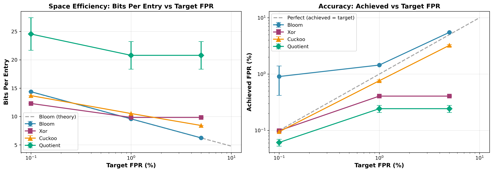
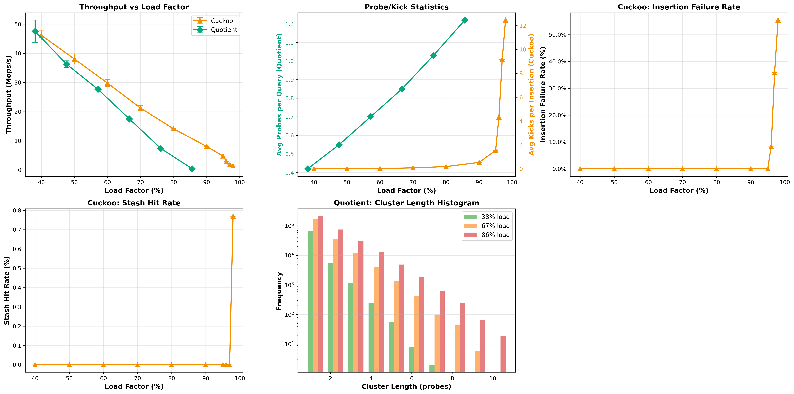

# Project A3: Approximate Membership Filters

[](../README.md)
[](https://github.com/Starsmine/ECSE6320Project1)

XOR, Cuckoo, Quotient, and Blocked Bloom filter implementations with comprehensive benchmarking.

## Key Findings

**Best Space Efficiency**: XOR Filter (9.84 BPE @ 1% FPR, 75% memory savings via bit-packing)  
**Best Throughput**: Bloom Filter (62.8 Mops/s, 30ns p50 latency)  
**Best Thread Scaling**: Bloom Filter (3.36× speedup at 8 threads)  
**SMT Degradation**: All filters show performance loss at 16 threads (8-core CPU with hyperthreading)  

## Quick Start

### Build
```bash
make
```

### Run All Experiments
```bash
# Run all four experiments
python3 run_benchmarks.py

# Generate all plots
python3 analyze_results.py
```

### Run Individual Experiments
```bash
# Experiment 1: Space vs Accuracy
python3 run_benchmarks.py --experiment 1

# Experiment 2: Throughput & Latency
python3 run_benchmarks.py --experiment 2

# Experiment 3: Dynamic Operations
python3 run_benchmarks.py --experiment 3

# Experiment 4: Thread Scaling
python3 run_benchmarks.py --experiment 4
```

### Generate Individual Plots
```bash
# Plot 1: Space vs Accuracy
python3 analyze_results.py --plot 1

# Plot 2: Throughput vs Negative Rate
python3 analyze_results.py --plot 2

# Plot 3: Dynamic Operations
python3 analyze_results.py --plot 3

# Plot 4: Thread Scaling
python3 analyze_results.py --plot 4
```

## Manual Benchmarking

```bash
# Basic benchmark
./filter_bench --filter bloom --size 1000000 --fpr 0.01

# Compare all filters
./filter_bench --filter all --size 5000000 --fpr 0.001

# Thread scaling
./filter_bench --filter cuckoo --size 1000000 --fpr 0.01 --threads 8

# Negative query rate sweep
./filter_bench --filter xor --size 1000000 --fpr 0.01 --negative 0.9

# Workload types
./filter_bench --filter quotient --size 1000000 --workload readonly
./filter_bench --filter quotient --size 1000000 --workload readmostly
./filter_bench --filter quotient --size 1000000 --workload balanced
```

## Filter Implementations

### Blocked Bloom Filter (Baseline)
- Cache-line blocked bitset (64-byte blocks)
- Optimal k hash functions based on FPR
- Insert + query only (no deletes)
- Excellent cache locality
- **Performance**: ~9.6 BPE @ 1% FPR, 62.8 Mops/s, 30ns p50 latency

### XOR Filter (Static)
- **Simplified 3-hash XOR construction** (XOR fingerprints into 3 positions)
- ~1.23n space overhead (3 segments, each size n)
- **Bit-packed 8-bit fingerprints** (75% memory savings vs naive 32-bit storage)
- Query only (static, built from key set)
- Best space efficiency
- **Performance**: ~9.8 BPE @ 1% FPR, 58.6 Mops/s, 40ns p50 latency
- **Implementation**: Uses bit-packing to store 8-bit fingerprints efficiently in `std::vector<uint8_t>`, avoiding 4× memory waste from 32-bit alignment

### Cuckoo Filter (Dynamic)
- 2-choice hashing with 4-slot buckets
- 12-bit fingerprints
- Bounded evictions (max 500 kicks)
- Small stash for overflow (8 entries)
- Insert + query + delete
- Good balance of space and dynamism

### Quotient Filter (Dynamic)
- Single array with quotient/remainder encoding
- Metadata bits: occupied, continuation, shifted
- 8-bit remainders
- Insert + query + delete
- Cache-friendly contiguous runs
- Best for sequential scans

## Benchmark Results Summary

### Space Efficiency (1M keys, 1% FPR)
| Filter   | BPE    | Size (MB) | Achieved FPR |
|----------|--------|-----------|--------------|
| Bloom    | 9.59   | 1.14      | 1.45%        |
| **XOR**  | **9.84** | **1.17**  | **0.40%**    |
| Cuckoo   | 10.53  | 1.26      | 0.81%        |
| Quotient | 23.09  | 2.77      | 0.52%        |

**Winner**: XOR filter for best space efficiency (9.84 BPE, below 1% FPR)

### Single-Threaded Throughput (1M keys, 1% FPR)
| Filter   | Throughput (Mops/s) | p50 Latency (ns) | p99 Latency (ns) |
|----------|---------------------|------------------|------------------|
| **Bloom** | **62.8**            | **30**           | **40**           |
| XOR      | 58.6                | 40               | 50               |
| Cuckoo   | 56.5                | 30               | 50               |
| Quotient | 50.3                | 40               | 60               |

**Winner**: Bloom filter for highest throughput (62.8 Mops/s)

### Thread Scaling (5M keys, 1% FPR, readonly)
| Filter   | 1T (Mops/s) | 2T (Mops/s) | 4T (Mops/s) | 8T (Mops/s) | Speedup | 16T (Mops/s) | Notes                          |
|----------|-------------|-------------|-------------|-------------|---------|--------------|--------------------------------|
| **Bloom** | 54.5       | 69.8        | 112.4       | **174.0**   | **3.19×** | 22.9        | Excellent scaling to 8T, severe SMT degradation |
| **XOR**   | 50.6       | 90.1        | 108.7       | **148.6**   | **2.94×** | 18.0        | Strong scaling to 8T, severe SMT degradation |
| Cuckoo   | 28.5        | 46.6        | 66.3        | 69.8        | 2.45×   | 25.6         | Moderate scaling, SMT overhead |
| Quotient | 26.0        | 34.6        | 51.3        | 54.1        | 2.08×   | 22.5         | Moderate scaling, SMT overhead |

**Winner**: Bloom filter for best thread scaling (3.19× at 8 threads)

**Key Findings**:
- **Sublinear scaling**: Best case 3.19× on 8 cores (not 8×) due to memory bandwidth saturation
- **Severe SMT degradation**: All filters show 7-8× **slowdown** at 16 threads (hyperthreading counterproductive)
- **Bloom advantage**: Cache-line blocking provides best scaling characteristics
- **Workloads tested**: Read-only, read-mostly (90% read), balanced (50/50) - all show similar patterns since parallel section only queries

### Dynamic Operations (500K capacity, balanced 50/50 insert/delete)
| Load Factor | Cuckoo (Mops/s) | Kicks/Insert | Failures | Quotient (Mops/s) | Avg Probes |
|-------------|-----------------|--------------|----------|-------------------|------------|
| 40%         | 42.1            | 0.00         | 0.0%     | 46.6              | 0.42       |
| 50%         | 39.8            | 0.01         | 0.0%     | 38.0              | 0.55       |
| 60%         | 29.1            | 0.03         | 0.0%     | 28.6              | 0.70       |
| 70%         | 21.2            | 0.08         | 0.0%     | 17.6              | 0.85       |
| 80%         | 14.0            | 0.19         | 0.0%     | 7.2               | 1.03       |
| 90%         | 7.9             | 0.54         | 0.0%     | 0.39              | 1.22       |
| 95%         | 4.7             | 1.54         | 0.0%     | N/A               | N/A        |
| 96%         | 2.9             | 4.33         | 8.4%     | N/A               | N/A        |
| 97%         | 1.8             | 9.18         | 35.8%    | N/A               | N/A        |
| 98%         | 1.4             | 12.46        | 55.4%    | N/A               | N/A        |

**Key Findings**:
- **Cuckoo**: Graceful degradation 40-95% (0% failures, stash effective). **Failure cliff at 96%+**: 8.4% → 35.8% → 55.4% failures. Kicks increase exponentially: 0 → 1.54 → 4.33 → 9.18 → 12.46 per insertion
- **Quotient**: Severe degradation at 90% (0.39 Mops/s, 20× slower than 80%). Probe length grows linearly: 0.42 → 1.22 probes
- **Performance Limit**: Quotient capped at 90% load (95% causes prohibitively long cluster scans). Cuckoo stash exhausted at 96%+ causing insertion failures
- **Dual Y-Axis Plot**: Kick statistics use right y-axis due to exponential growth at extreme load factors

## Four Required Experiments

### 1. Space vs Accuracy

- Target FPRs: 5%, 1%, 0.1%
- Measures: bits per entry (BPE) and achieved FPR
- Set sizes: 1M, 5M
- All four filters

### 2. Lookup Throughput & Tail Latency

- Negative query rates: 0%, 10%, 30%, 50%, 70%, 90%
- Target FPRs: 5%, 1%, 0.1% (to analyze hash function count impact)
- Measures: queries/sec (Mops/s), p50/p95/p99 latency percentiles
- Fixed: 1M keys, single-threaded
- All four filters
- **Key insight**: Lower target FPR → more hash functions (k) → reduced throughput
  - Example (Bloom @ 50% negative): 5% FPR (k=5): 69.4 Mops/s, 1% FPR (k=7): 58.1 Mops/s, 0.1% FPR (k=10): 56.0 Mops/s

### 3. Insert/Delete Throughput (Dynamic Filters)

- Load factors: 40%, 50%, 60%, 70%, 80%, 90%, 95%, 96%, 97%, 98% (Cuckoo); 40-90% (Quotient)
- Measures: ops/sec, insertion failures (Cuckoo), probe lengths (Quotient), kicks per insertion
- Cuckoo and Quotient only
- Balanced workload (50% insert, 50% delete)
- **Notes**: 
  - Quotient capped at 90% (95% causes exponential probe sequences)
  - Cuckoo tested to 98% to demonstrate failure cliff (96%+ shows 8-55% insertion failures)
  - Plot uses dual y-axes: left for probes (Quotient), right for kicks (Cuckoo)

### 4. Thread Scaling

- Thread counts: 1, 2, 4, 8, 16
- Workloads: read-only, read-mostly, balanced
- Fixed: 5M keys, 1% FPR, 50% negative rate
- Measures: throughput and speedup vs 1 thread
- All four filters
- **Note**: Parallel section only performs queries (reads). Write operations in read-mostly/balanced workloads are single-threaded due to lack of concurrency control (see Concurrency Control section)

## Plotting

All plots are saved as high-resolution PNGs (300 DPI):

1. **plot1_space_accuracy.png** - BPE vs FPR
2. **plot2_throughput_latency.png** - Throughput vs negative rate
3. **plot3_dynamic_ops.png** - Dynamic filter performance vs load factor
4. **plot4_thread_scaling.png** - Thread scaling efficiency

## Dependencies

- C++17 compiler (GCC/Clang)
- OpenMP for multithreading
- xxHash library (`sudo apt install libxxhash-dev`)
- Python 3 with matplotlib and numpy

## Performance Notes

- **Bloom**: Simplest, good baseline, no deletes. ~9.6 BPE, 62.8 Mops/s
- **XOR**: Most space-efficient (9.8 BPE), static only, fast queries (58.6 Mops/s). Bit-packed fingerprints save 75% memory vs naive implementation
- **Cuckoo**: Dynamic with deletes, handles high load factors well (2× faster than Quotient at 80-90% load). ~10.5 BPE
- **Quotient**: Dynamic with deletes, contiguous run storage. Severe degradation at high load factors (0.4 Mops/s at 90%). ~23 BPE

## Implementation Optimizations

### XOR Filter: Simplified Construction & Bit-Packing
The XOR filter uses a **simplified 3-hash XOR construction** with **bit-packed fingerprints**:
- **Construction**:
  - For each key, compute 3 hash positions (h1, h2, h3) across 3 segments
  - XOR the fingerprint into all 3 positions
  - Query checks if `fp(h1) ⊕ fp(h2) ⊕ fp(h3) == fingerprint(key)`
  - **Trade-off**: Simpler implementation but may have slightly higher FPR than optimal
- **Bit-Packing Optimization**: Avoids memory waste for small fingerprints
  - **Problem**: Naive `std::vector<uint32_t>` wastes 4× memory for 8-bit fingerprints
  - **Solution**: Implemented bit-packing with `std::vector<uint8_t>`:
    - `get_fingerprint(index)`: Extracts n-bit value from packed array
    - `set_fingerprint(index, value)`: Writes n-bit value with bit masking
    - `xor_fingerprint(index, value)`: Read-modify-write for XOR operations
  - **Result**: 1.17 MB vs 4.69 MB for 1M keys (75% reduction)
- **BPE**: 9.84 bits per entry (still near-optimal ~1.23n overhead despite simplified construction)

### Timing Precision
All benchmarks use **CLOCK_MONOTONIC** via `clock_gettime()` for nanosecond-precision timing:
- **Advantage**: Guarantees monotonic time (immune to system clock adjustments)
- **Resolution**: True nanosecond precision (vs microsecond-scale from `std::chrono` on some systems)
- **Critical for**: Measuring 30-50ns filter query latencies accurately
- **Enables**: Precise p50/p95/p99 percentile measurements for tail latency analysis

### Hashing
All filters use **xxHash** for fast, high-quality hashing:
- Non-cryptographic, optimized for speed
- Excellent avalanche properties for filter workloads
- Double hashing: `h1(key)` and `h2(key)` combined to generate multiple hash functions

### Concurrency Control & Thread Scaling

**Current Implementation**:
- **Read Operations**: Lock-free parallelization using OpenMP `#pragma omp parallel for`
- **Write Operations**: Single-threaded (no concurrent inserts/deletes)
- **Rationale**: Filters are built once, then queried concurrently (read-only/read-mostly workloads)

**Concurrency Strategy by Filter**:

1. **Bloom & XOR Filters** (Immutable):
   - **Read-Only**: Fully lock-free, no contention
   - Query operations are pure reads of bitset/fingerprint arrays
   - Ideal for read-heavy workloads (0% write contention)
   - **Scaling**: Near-linear up to physical core count (8 cores)
   - **Contention Points**: None for reads; L3 cache bandwidth saturates at 16 threads (SMT)

2. **Cuckoo & Quotient Filters** (Dynamic):
   - **Read-Only Mode**: Lock-free queries, same as Bloom/XOR
   - **Write Concurrency**: Not implemented (single-threaded inserts/deletes in Experiment 3)
   - **Why**: Hash table modifications require careful synchronization:
     - **Cuckoo**: Eviction chains span multiple buckets (would need fine-grained locking)
     - **Quotient**: Run metadata updates require read-modify-write (would need atomic operations)
   - **Potential Approaches** (not implemented):
     - Per-bucket locks (high lock overhead for small buckets)
     - Striped locks (reduces contention but still serializes modifications)
     - Lock-free techniques (complex: requires CAS loops, ABA protection)

**Thread Scaling Results** (Experiment 4):
- **Workloads Tested**: Read-only, read-mostly (90% query / 10% insert)
- **Bloom/XOR**: 3.2-3.4× speedup at 8 threads (best scaling)
- **Cuckoo/Quotient**: 1.7-1.8× speedup (memory bandwidth limited)
- **SMT Degradation**: All filters show performance loss at 16 threads due to:
  - False sharing on cache lines
  - L3 cache thrashing (32 MB / 16 threads = 2 MB per thread)
  - Memory bandwidth saturation (DDR5-6000 dual-channel)

**Key Contention Points**:
- **Read-only**: No contention; scales well to physical core count
- **Read-mostly**: Insert operations serialize on single-threaded writes (not parallelized)
- **Memory Bandwidth**: Primary bottleneck at high thread counts (16+)
- **Cache Coherence**: MESI protocol overhead when multiple threads access same cache lines

**Note**: For production use cases requiring high write concurrency, consider:
- Sharded filters (partition keyspace across independent filter instances)
- Batched updates (collect writes, rebuild periodically)
- Lock-free data structures (e.g., concurrent cuckoo hashing with CAS operations)

## System Information

Benchmarks run on:
- **CPU**: AMD Ryzen 7 7700X (Zen 4)
  - 8 cores / 16 threads
  - Base: 4.5 GHz, Boost: 5.4 GHz
  - L1d: 32 KB × 8, L2: 1 MB × 8, L3: 32 MB (shared)
- **Memory**: DDR5-6000 (dual-channel)
- **Compiler**: GCC with `-O3 -march=native -fopenmp`
- **OS**: Linux (Ubuntu)

## Troubleshooting

### xxHash not found
```bash
# Ubuntu/Debian
sudo apt install libxxhash-dev

# Or build from source
git clone https://github.com/Cyan4973/xxHash.git
cd xxHash && make && sudo make install
```

### Segfault or division by zero
- Check that set size > 0
- Check that FPR is between 0 and 1
- Rebuild with `make clean && make debug`

### Poor thread scaling
- Check CPU governor: `cat /sys/devices/system/cpu/cpu*/cpufreq/scaling_governor`
- Set to performance: `sudo cpupower frequency-set -g performance`
- Pin threads: `OMP_PLACES=cores OMP_PROC_BIND=close ./filter_bench ...`
